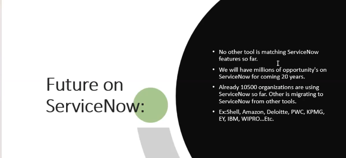
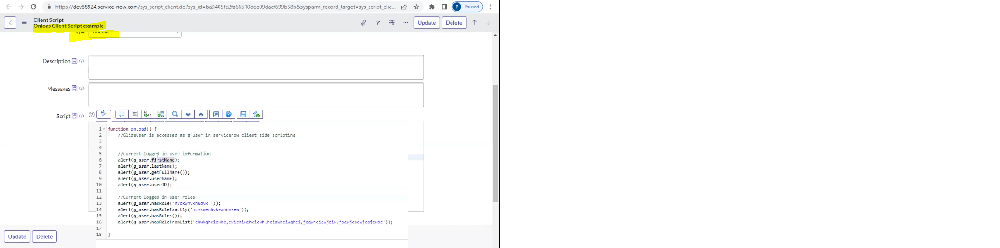
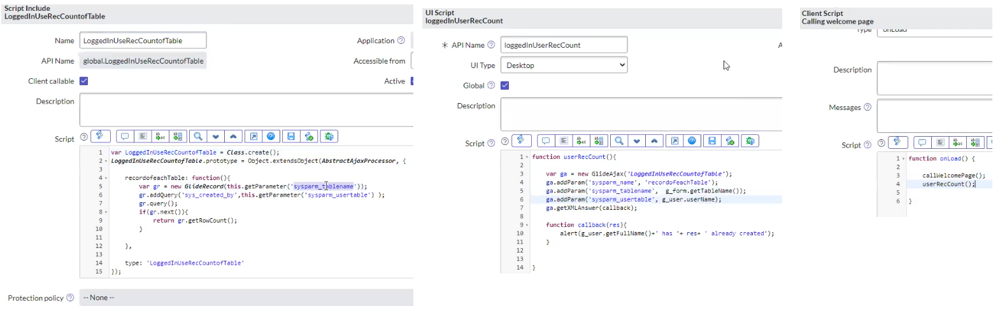
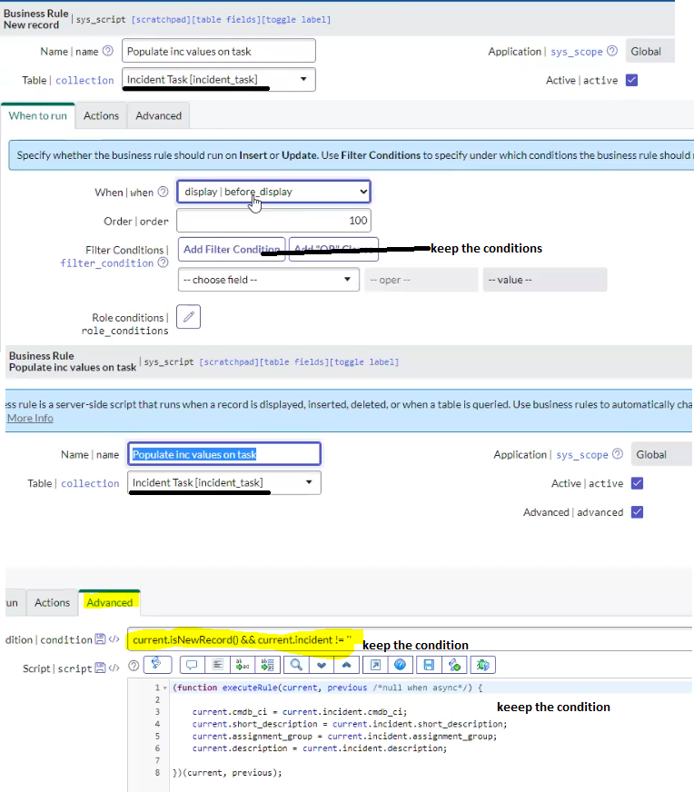
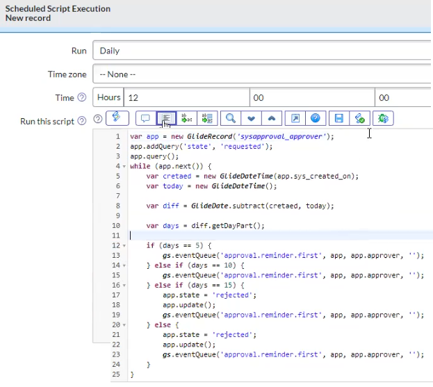

* servicenow is cloud platform 
* servicenow we use for automating the process like timesheet management leave managenmet or intervicvew management 


* because of its flexibilty we can modifi software aucording to our organigation like u have 10 feild on form and u want to create other 5 feilds u can create 
* it can ingegrate with 3rd partys tools like facwebook or whatsup many 3rd party tools u can if u want to communincate extenal tools u can communicate 
* Automate the process 
* service now supports imports and exports u have data in excel sheet u can import that data from excel sheet to servicenow  u can create the record in servicenow system and u have data some ware in server u can pul the data from the server and pleace it into servicenow system 
* Language translation gernmen pepol can get servicenow in german language 
* workflow automation 
* cloud based




* __impersonate user__ u can login as another user no one can login as another use who can login that who has access servicenow doveleopre who has admin role can login as another user 
* why we use impersonate user becouse u have may user in ur organazation and some one come to u  telling that some of features not working fine then u need to check if that feature really is not working or something happen then u need to login as a that user to check is it really that user facing any issue 
* as a admin u can work on every thing execpt __access control__ if u want to work on __access controal__ u have to __elevate role__ (security_admin) gran modification access to hight security settings, allow user to modify the access control list


* if u want to access the servicenow platform u must be a servicenow member servicenow user 
* groups are nothing but teams in organaization like we have linux team devops team like that 
* teams nothing but groups in servicenow system 
* new -> name -> manager -> group email -> description 
* in team we have group members(team member) -> edit -> collection(u search the team members name add) save
* Roles are nothing but permissions
* __logged in users__ u have many user in ur  org but u want to know how many user are currently logged into servicenow system u can see 
* __Departments__ u can create department u can  like (hr, finace, r&D) like that 
* __Deparment -> new -> name -> departmentHEad ->  Primary conact ->__
* then user details u can mention department[R&D] user belong to R&D department
* __Delegation__ one user in compayni going to vaction for some long period so that  give all responsibilty to some on in same org for some specific period 
* __so goto vatcation going users account there is option like delegates -> new -> delegate(who is taking other users respnociblitys) -> start time and end time -> apporvels -> assignmetn -> all notification -> meetings invitaions__
* __user Roles__ user have how many roles user account -> username -> roles -> u can see user hava how many roles
* u can go userRoles -> all ->  u can type user name -> role admin(u can search how many user have admin role)
* dont add roles to user becouse u have 1000s of user then how can u able to mange so u have to add users to group then add role to group 
* __Group Roles__ u can check group has how many roles 
4 
* Data in servicenow system will store in table format rows and colums 
* When ever ur loading the data in servcenow system it will import into __imp_user__ table after that __Sys_user__
* __Group__ servicenow has created __Group__ table from this group table they design the groupform   can see the list of groups similoly roles 
* everything in servicenow is tables 
* servicenow developed some of __itsm__ application suing tables 
  * Incident Management
  * Problem Management
  * Change Management 
  * Knowledge Management
  * Service Level Management
  * Request Management

#### Incident Management
* Incident is sudden interputction services is called Incident (ur application is working everyday al of sudden not working)
* Incident Management to restore the service back we use  Incident Management
* in the servicenow system servicenow developed incident management in the servicenow system so how did servicenow developed this incidentmanagement service created a table called incident table  and created so many feilds 
* tables -> incident -> show form -> it will open incident form 
* my laptop working fine  all of sudden  is not woring fine (incident) it is not working fine i wont be delever the work so to get the laptop woking again i have to create incident record 
* __number -> caller -> category -> subcategory -> service -> chanel -> state -> impact -> urgency -> 
* priority data lookups table in that there perdifined data there like if imact is high and urgeny high then priority critical 
imact high urgency medum priority is high like that
* once assigne to some one in group(team) it will go to state inprogeess means some one is working in this incident 
* once incident is resloved the user of the incident will closed the incident other wise automaetically it will close by system for that  


* autometically closed by system(incident) __incident properties__ -> enable auto closure of inident based on resolution date -> number of days (integer) after which resloved incident  -> 
* in the servicenow system this incident management process is developed by creating incident table
* incident table in this incident table they have created multiple feiled SUCH AS caller catogery sub-catogery and many thing and they desigen the incedint form so this form will be use all the employ in the organazation 
* why do we use Incident form  to report the incident 
* we will be desigen the incident form if already desigen the incident form we have to customizeation 
* u want to create new field -> configure -> form desigen -> u can select the form like incident or other in that many fields 
* AS a servicenow developer we will be customizing the incident managemet change management problem managment servic level management request management we be making the custmization 

#### Problem Management
* Problem: im faing some issue in my laptop and i raise the incident then issue is reslove after some time again my laptop is not working fine so again i rasie the incident and issue reslovd again same thin happen issue is not resloveing permently 
* the laptop issue happeing repetadly in that case we consider as __Problem__ 
* the same incident happeing repetadly we callit as __problem__
* Problem is Root couse analosis why the laptop  is going down why laptop contionously not working we have to do  some root cause analasis to do root cause analasis we go for problem 
* Problem: if an issue is repaetdly happening we call that as problem 
* Problem management: to identify the root cause we got for problem managment 
* Problem can be created in 2 ways:
  * From Incident 
  * Directly we can create a problem 
* in problem we have state assess it means we will check weather it is rally problem or not 
* why we need to check it is really problem or not becouse some cases instead of creating incident they created a problem 
* Problem-Task u need any inputs from any other team like u need approveal from change management team u need to create problem task 
6
#### Change management
* Change if ur adding something new to exesting paltform  it is called 
* ur changeing something exeiting patform 
* types of changes
* Normal    -- on some day

* on same day is there any change request with same configuration is running
* Maintance Window -- only during the maintance window we impliment the change request
* usally december is blockout window rest of the time is manitaince window 
* if it is any change request comes in december month it will be conflict and also if ther are change request are running with inthe window(Maintance window) same configuration that is also conflit 
* u go for request approvel once u click on request approvel it will send request to assignment group 
* Emergency -- Immediatly Basi


* Standard  -- Regular Intreval doing same activity every 15 days like that 
* u create problem from incident u can also create the __change__ from the incident 
* we will be creating teamplate with predefined values 
* search change -> under standard change there is option is my proposals -> new -> after request the change manager approvel once change manager approved this one standard change proposal completed close
* standard changes are preapproved change request it will be approved only one time it can be reused once it approved and closed we can directly u can shedule 
* __ITIL__ Information Technology Infa Structure Library
* the person who has this ITIL role in the organzation they can read write create __incident,problem,change__ request 
* __ITIL__ -- Read, Write, Create
* __ITIL_Admin__  -- Read, Write, Create, Delete
* __Knowledge Management__ u want to share ur knowladge to some one in ur organzation then u go for knoledge management 
* All -> Knowledege -> create new record -> knowledge base -> published -> valid to -> workflow ->  view artical  
* Knowledge bases are use to manage knowladge artical 
* I want to availabel knowledge artical to only few employee  not everyone can see this artical and how many days this knowledge artical valid i can define it using knowladgebase who can comment on this one 
* knowledge should be review before publishing by knowldege base owner (IT,Admin) like 
* once approved it  can published state  once publish stage who can access those who has can read permission they can see  only in published stage if it is not published stage those people also can't see this knowldege artical 
*  once this knowldegebase reaches prticulor valid date it will go workfolw __pendding retirement state__ again knowldge base   owner has to confirm wehte it has to retier or not 
* draaft -> reivew -> published -> pennding retirement -> retired    
* knwledge artical process desined in the workflow 
* to mange this knowldege artical backend workflow willbe running 
* __Knowldege artical__ lifecycle Knowledge base -> category -> valid to -> short description ->artica body ->  workflow -> then u click on publish it will goto reviw phase in review phase knowledge base owner should be approved once he approves it it will go to publish state in the publish state who hase permission read can  only they can read then once it reachs to valid to it will go to pendding retairment state once knowldege base owner has to approved it will go to retairment state this knowledge life cycle to mange this life chycle there are workflos are running bagground those workflows u can see t inthe knowldege base level 

##### Reuest Management
* if u want to something from some one or u want something new u will have to request 
* u need some documentation form other team access some other team
* u want laptop then u have to rise the request once u rise the request wu will be provided the laptop once u got the laptop while u working on the laptop it stoped working then u create incident 
* application navigator all -> request -> service catolog -> click on request 
* if u want to new create request  by subbmiting the catolog 
* Maintain Items -> request laptop -> try it  -> it will go service catalog -> oftware -> request laptop -> order now 
* Request are subbmited from catolg items 
* request are not directly created  request are subbmittted from the catalog 
* __Service Level MAnagement__ when u want to provide the quality work 
* service level agrrement for only incident request not for  problem and changes 
* SLA definitaions -> new -> 


###### Case
* tcs purchasing servicenow producet from servicenow company Tcs coustmer of servicenow company 
* if something is not working within the organaization we will create incident if servicenow itself not working servicenow application is tootally not working then we have to contect to servicenow company so TCS has to rise case to servicenow company 
* create case table -> case form -> 
* Tables -> undersystem defination u will find tables -> new table -> lable(employ will see this label) CASE -> name(devloper) ->  
* when u create tables in service now u will get by default six fields 
```
Created by    --  (created person alway one person who ever create first time)
Created       --  (created time when it was created firstime)
Sys ID 
Updates
Updated by    --  (who updated last time )
Updated       --  (When was the updated last time) 
```
* sys id is uniq id that will b assigen to a record when ever a new record is created end user will not know what is sysid 
* for new record sys id always -1 (in url there is __https://dev8989.service-now.com/u_case.do?sys_id=-1__) 

* incident form problem form change form user form for new record sys id always -1 when ever create record a new sys id will be generated the sys id will assigne to this particulor record 
* sys id 32 alphanumaric charctor this uniq wich not mach any other record 
* if u want to show case form in two colum go to case table -> desigen form -> from the form design u can make form into 2 colum select 2 colum and whate ever u want to show in second colum u can drag and drop 
* from the form desigen also u can create new field
* __syd id__ is uniq alpha numariq and __number__ is also uniq but __number__ is for end user __sys id__ is for servicenow developer 
11
* to create section u need to go  form desigen -> click + icon -> 1 colum sectionname [system information] then drag and drop -> 


* __Activities(filtered)__ if use this what is happening on that record everything shown in the ativities filtered like when u change caller when u change paritculor field every thing will tracked activiefiltered 


* what changes happen wat what time u can trac everything in activitfiltered
* __Watch list__ in refreacne u can select onely one value in watch list u can select multiple values 
* u can create choices in feild and form form also u can create choices 
* what ever we have done it  using formdesign same thing we can done using __Layout form__ 
* we can create fields form table or formdesigen or layout form 
* Same form show in difreant view like china peoples difreant form difreant regions difreant form table is same case table 
* user login in from china how to konow the system this user belongs to china for that user have location field once user login from china it should show china form view for that we have view ruls concept 
* all -> view rules (under system UI) -> 


* there person loged in china form should shown in china view

12
* Show list it will show the list of case records that we created  (collection of record is list)
* __Application Menus__ 


* in application menu we will create modules ussally we use new record, list of records, URL (from Arguments:), Separater(in module we have sub-moduls)

```
https://dev88924.service-now.com/  - This BAse URL

dev88924   -  Instance ID

https://dev88924.service-now.com/u_case.do  it will open the case form  (case is here table)  

https://dev88924.service-now.com/incident.do   it will open incident form 

https://dev88924.service-now.com/problem.do   it will open problem form 

https://dev88924.service-now.com/sys_user.do  new user record

https://dev88924.service-now.com/u_case_list.do  open case list 

https://dev88924.service-now.com/incident_list.do opne incident list 

https://dev88924.service-now.com/sys_user_list.do

https://dev88924.service-now.com/sys_user_group_list.do

u_case.form  it will open new form 
u_case.FORM it will open new form in difreant tab 
```
* after Base URL what ever usng those are called URL Parameter 

* when we creating module in application menu like when we click module it will create new record with help of linktype is new record there is other option is URL(form Argument) in that (u_case.do?sys_id=-1) means it will open new record 


 
* u can pass the url argument in the modules 
* when u Pass the URL Arguments when ever u create new record short-dicription will come uday 


* from the URL aslo u can populated the values 

* __Template__ predifend values 
* ALL -> system definiation -> template -> 


13
* when ever u creating any case record with out any input u can save the record so u dont want to save empty record u have make some mandate feilds for that  on the feild like caller place the cursor right click -> configure dictionary -> select the mandatory check box 
* in form there is some fields like user cant edit write(like priority field user cant do anything with that) so make that as read only 


*  in calller feild i want name like who ever loged into the servicenow that user  name will be populated 
* when we open new form there is state value none so i want to state valu will be new for that 
* open form -> rigtclick on the state -> configurate dictionary -> choices -> default value -> new  will be populated 
* when u use default value in feilds it will constant like if use date feild today ur using the data will be 27 like tomarow also 27 will be populated if u use default value the value will nerver change 
* so instead of default value we will use __calcualted value__ 


*  __current__ object will hold the form feild value like current object hold number feild value , caller system administrator value , data current obeject hold  in form all values stored in the  current object 
* if u want to get Number __current.u_number__ __current.u_caller__ __current.u_category__


* dependent feild like software and moniter there is no relation like if we select data base in category in sub-category there will be a database related onnly display that shy dependent 


* if we select the software in Category the software related values should appear in sub-category for that sub-category -> right click configura dicitionary -> click dependent field -> select use dependent field -> dependent on field (category) update 


* __SN Utils - Tools for ServiceNow__

* on the incident form make the feild mandtory? or make the feild read only ?
* Right click on the field  -> goto configure dectionary there is option like active or read_only, mandatory, display

14 

* __choice list specification__ ther is some feilds like category in choice  u will see option like none by default it will be  none if u want with out none goto -> right click feild configure dictionary -> there is option like __choice list specification -> __choice [dropdown without--none--(must specify a default value)] -> u have to specify default value
* selecting dropdown without none u must be specify default value 
* suggestion if write some word it will suggest the full word like har (Hardware)
* in choice 


* Refreance specification tab is available for only refreance and list type of fields u wont be find in choice type of feilds 

* when u click on serch button in caller feild u will see the all user list so i dont want to see all the employee list when click the serach button i want to see only limited member like HR  deparment user for that we have to use __Refreance Qualifier__
* if u want restric the data that u see in the refreance type of feild or if u want to restric the data that u see in the list type of feild then u use refreance qulifier 

* caller -> configure dicitionary -> reference qual condition -> department is HR
* then u will see the Employee list only HR department because we restricted the data using refreance qualifier 


* 3 Types of Refrence Qualifiers
  * Simple
  * Dynamic
  * Advanced
* in simple reference qualifier we can keep the condition what ever condition we cant keep in the simple reference those condition u doit in Dynamic and Advanced reference qualifier    
* when we select the  specific assignment group we will see the assigned to users only who belongs to that particulor group for that we need to use Advanced Qualifier 

15

* in the reference feilds if u want to restric  the data that u see then u will reference qualirier 

* Look UP Rules:
* if u select the imapct   [2-Medium]
                  Urgency  [2-Medium]
                  Priority [3-Moderate]
* u wnat to create case priority look up rules 
* based pn __Impact__ and __Urgency__ __Priority__ value will be setup 
* if u want to create ur own lookup rules for that we have to create __Table__ -> Tables(system definition) -> new -> Case Priority look up -> name -> Extends table[data lookup matcher rules] -> save  New feilds -> imapct,urgency, priority ->  

* Assignment look up table  created then   in this table category as database sub-category as a cpu assignment -group as a network 
* create Assignment lookup table in that extended table [data lookup matcher rules]  in that created 3 feild like assignmet group, category, sub-category in this category i have created choice called databse choice  in sub-category choice called cpu choice Assignment-group is reference type after createing this table open this form (table assignment look up) created a record  catagory as a database sub-category as a cpu asssignment group as network then created record if u want to see that record goto table tabble assignment lookup show list u will be see only one record  after creating this tabble then lookup definitaion case assignmnet group lookup rules [matcher field dififnition](sub-category and category) if this are match [setter feild difinitions](assingment-group) 


16 

* __Child Table__ 
* When u create a table u want to table will extend then u have to select the option like Extensible[_/] only then u can extend the another table  

* When u create new table -> case task table -> name -> Extends table (if u want to extend the table the table has to be extendable for that go to that table (all Table -> Case -> controls[extensible true])) -> search the case table -> if u want to this task table the application menu that we were created (case management) select we will show the module what ever we are creating that will appear under case management 


* we have created a case table and we link into tasktable with case tabel and securitytasktable whatever in case table feilds will be appaer in tasktable and securitytasktabe (i want configuration item feild will be read&write in case table but configurationitem read only in casetask table and securitytask table for that ) this feild belongs to case table goto there -> open -> dicitionary overrides -> select the table -> column name -> then -> select the override mandatory -> mandatory 

* using Diccitionary override we break the chain 
* go to particular feild u can create dicitionary override 


*  u have case table and taskcase table and securitycase table on taskcase table caller feild i want to only hr deparment in securtycase table caller feild i want security department for that u need to goto override dicitinoray -> override reference qualifier -> reference qualifier [department=depid354623564283rf98h98yf] 

* some of one feild(discription) mandetory on incident form so do directly make the feild mandatory befor making the mandatory u have to check weather feild belongs to same table or parant table if make mandotry on parent level that will make mandotry all the cild level 

17

* u can add rows difreant sources not only using the form to add a new row on the table 

##### UI Policy
* If we want to make feild readonly, madatory, show or hide the feild at certain  condition is called UI Policy 

##### DATA Policy 
* If we want to make feild readonly, madatory, the feild at certain  condition from all the sources(it can be third party email, form, execl sheet) is called DATA Policy  

* when caller and affected caller are not empty, make assignment group mandatory to achive this go to UI Policy  -> right click -> configure -> UI Policies -> new -> caller is not empty and affected caller is not empty save -> then -> UI Policy action new -> field name [assignment Group] -> MAndatory [true] submit 
* if u make caller and affected caller mention the assignemnt group will become mandatory but if u make any of the caller or affected caller empty it will not become non mandatory for that goto UI Policy __Reverse if false__ (the condition is not matching the changes will be revers back) 
* if caller and affected caller vale coming from default values then assignment group not becoming mandatory for that in UI Policy we have to make __On load__ 


* when caller and affected caller is not empty they must pass assignment group    
* If i dont pass assignment group value  im abel to submited thats where __DATA Policy__ com into pitcure 
* convert this DATA Policy if u make this as DATA Policy UI Policy will become inactive 
* this DATA Policy act as UI Policy also 
* if the data policy should work on chid table __Inherit__ 


* in data policy u read only and mandatory two options 
* In UI Policy mandatory, vicible, read only, clear the field valude 
* in ui policy u can write the script but in data policy  u cant write script and if u want to show or hide related list that is cont done  using data policy u can do in ui policy 
* if u want to ui policy work for only some certian region like australia for that un check Gloal[] then view and mention region(australia)

* What is the difreance between UI Policy and DATA Policy?
* UI POlicy only work for form 
* Using UI Policy u make feilds mandatory, read only show or hide the feild u can write the scripting u can show or hide related list u can make policys to specific view 
* DATA POlicy work for all the data sources 
* using data policy u  make feild mandatory and read only 

18 

##### Client Script

* A pice of java script runs on client side to make the chnages 
* if u want to make the chages on form we will use java script 
* Client script is pice of java script that is used to make the changes on the form 
* There are 4 Types of client Script 
 * __Onload__ onload client script  will run every time u load the form 
    * __alert__
    * __prompt__
    * __confirm__
 * __Onchange__
    * on form when ever u change the particulor feild as soon as u change the value imediatly __onchange script__ will run 

    * when ever u change on particulaar feild the __Onchange__ script will run and also  this __Onchnage__ client script will also work everytime form loads like __Onload__ script 

  * __Onchange__ client script will work on __onchange__ and also __Onload__
 * Onsubmit
 * Oncelledit
* Case form -> right click -> configure -> client script -> new -> Table -> Type -> 


* every time we refresh the form onload script will run and show the alert 
* __Alert__ have one button called __ok__
* __pormpt__ have __ok__ __cancel__ and __input__ will able  to see extra 
* __Confirm__  have __ok__ __cancel__ use to show the messages 
* To Create new template for tha ...  __Toggel Template Bar__ make it global(it available for everyone)


* new case form -> in botom there is option like __TEMPLATE29__ the values are set from teh template 
* when u are entering the values from the template the is template is true 
 * __On Submit__  
* everytime we load the from __onload__  will run everytime when we change the value on particulor feild on change client script will run and __Onchange__ Client script can also work on the __Onload__ only when u remove the condition(if isloading) form the __OnChange__ client script
* __Onsubmit__ Client Script will run before u submit the form 
* search -> client script -> new -> 


* __onCellEdit__ client script will not work on the __form__ this will work on __CaseList__ on the list wich pariculor feild value change  oncelledit client script will run 
* u have to specifi while creating the __OnCellEdit__ Client script  when u creating the __onCellEdit__ client script u have to select the particulor Field name
* If u want to change the 4 rows value use ctrl then select the multiple  feilds 


* we have 4 types of client scripts
  * __Onload__
  * __Onchnage__ 
  * __OncellEdit__
  * __OnSubmit__
* Onload will  run everytime when form lods 
* Onchange will run when u changing the value on particulor feild and when u remove the condition on onchange client script then it work like onload 
* Onsubmit will run before the form submition 
* Oncelledit only work on list when ever u change particular feild on the list oncelledit client script will run 
* Onchange client script will have 5 paramiters    
  * Control 
  * old value
  * new value
  * is loading 
  * is template 
* onCellEdit we have 5 parameters 
  * sys ID
  * Table
  * old values
  * new values
  * callback
* these clients script are used make the chnages on form   

19 

* on laod, on change, on submit, on cellit, in java script this are called events 
* we have client side apis:

* __Client Side API(Application Programming Interface)s:__
* GlideUser
  * The GlideUSer API provides methods and non-methods properties for finding information about the __Currently logged__ in user and their roles 
  * it is used to get the information about __currently logged in user and their roles 
  * we access GlideUser in the servicenow __g_user__  __g_user__ Means __GlidUser__

  * __alert(g_user.hasRole('uwhrfjnc'));__ hasRole will check for particulor role the current logedin user does have particulr role it will give true if the current loged in user doesnt have this partciculor role it will additionaly chaeck for the adimin access if he his admin it will return true if he his not an admin he doesnt have role then it will give the answer has false
  * __alert(g_user.hasRoleExactly('fdgfuwhrfjnc'));__ it will check for the exactly for this role it will not check for the admin aaccess 
  * __alert(g_user.hasRole());__  the current user have atleast one role there are 500+ role if current loged in user have atleast one role then it will give the answer true or else false
  * __alert(g_user.hasRoleFormList('erfwefef,wfewgwrg,wwef,wgrgv,wtrgvr'));__ if the current loged in user have atleast one of this mentioned role it will additionaly check for admin access if he his admin it will give the answer true
* __GlideForm__
  * The GlideForm client-side API provides methods for managing form and fields including methods to:
  * if u want to manage the form and form feild we will use __GlideForm__ API 
  * GlideForm can be access using __g_form.<method name>__  in servicenow scripting 
  * GlideForm API: is used to make the changes on form 
  * it is accessed as __g_form__ 
  * __g_form.addInfoMessage('Hi how are u');__ it will show the message on form and eorr message also show the message but it will show in the red colour 
  * __g_form.addErrorMessage('please enter the value and ur in danger');__ it will show the message on form in red colour 
  * __g_clearMessage();__ it will clear the message 
  * __alert(g_form.isNewRecord());__ is form is new record or existing record
  * __g_form.setMandatory('u_affected_Caller',true);__ it make the feild manadatory 
  * __g_form.setMandatory('u_configuration_item',false);__ if the feild is mandatory then it will become non manadatory 
  * __g_form.setReadOnly('u_contact_type',true);__
  * __g_form.setVisible('u_contact_type',false);__ it will hide the feild but space will be there to remove the space then use __g_form.setDisplay('u_contact_type',false);__ it will hide and remove the space 
  * __g_form.setDisplay('u_contact_type',false);__  it will hide and remove the space
* __what is the difreance between set.Visible and set.Display ?__
* __both will hide the feild but space will remove only when u using set.Display if u are using set.Visible it will not remove the space__
  * __alert(g_form.getValue('u_short_description'));__ it will show the  u_short_description value
  * the current object will work at server level and __g_form__ will work at Client level 
  * if u want to set the value __g_from.setValue('u_short_description','helo team, how  are u');__
  * __g_form.showFieldMsg('u_caller', 'caller can never be contingent employee','info' or 'error');__ info blue color erorr wil be red color  if u want to show any message after the feild 
  * __g_form.hideFieldMsg('u_affected_caller');__ it will hide any message after the affected caller 
  * if  u want to hide all the feild message __g_form.hideAllFieldMsgs();__
  * if u want to hide section it self __g_form.setSectionDisplay('',true);__
  * __g_form.setSectionDisplay('resolution_information',false);__ [Resolution Information] section name will always small latters only and first space will become underscore after that combine all words like (Resolution Information Notes) __resolution_informationnotes__
  * __alert(g_form.getSection());__
  * __g_form.setSectionDisplay('resoluton',true);__ if u want to show the section 
  * __g_form.hideRelatedList('REL:83084039ur302r809');__ it will hide related list 
  *  __g_form.showRelatedList('REL:83084039ur302r809');__ it will show the related list
  * __g_form.showRelatedList('');__ it will show all the related list 
   __g_form.hideRelatedList('');__ it will hide the all related list 
  * if u want to hide the magnifing glass in the feild rigjt click inspect -> point to the maginigng glass and copy the id(lookup id) __g_form.getElement('lookup.u_case.u_caller').style.display = 'none';__ then make sure __isolate script__ check box unchecked 
  * __g_form.getElement('u_case.u_Short_description').style.color = 'red';__
  * __g_form.getElement('u_case.u_number').style.backgroundColor = 'green';__
  * __alert(g_form.getUniqeValue();__ if u want to get the record system id 
  * __alert(g_form.getTableName());__ if u want to get tabelname
  * __g_form.addDecoration('u_caller','icone-star','Caller is mandatory');__ add star in front of caller feild 


20

* if the logged i user has itil role, only then category and sub category fields should be visible on case form?

```
function onLoad() {
  if(g_user.hasRoleExactly('itil')){
     g_form.setDisplay('u_category',true);
     g_form.setDisplay('u_sub_category',true);
  }else{
     g_form.setDisplay('u_category',false);
     g_form.setDisplay('u_sub_category',false);
  }
  }

```
* add itil role to user then goto search -> users -> search the particulor user -> scrol down and Roles -> edit -> collection -> itil -> save then refresh the form again u will see the category and sub-category  if u want to response imidiatly u have to loged out and loged in 
* why we using __onLoad__ client script becouse before showing the form it will check user role then show the  feilds otherwise if using onchange or any other script u can see the feilds and u write something in that then u going to save it will not display those feilds   
* when ever we open the form caller name will current logedin user name populated this happen in only new records 

```
function onLoad(){
  if(g_form.isNewRecord()){
    g_form.setValue('u_caller',g_user.userId);
  }
}
```
* if the caller user belongs to HR department then i have to make discription feild mandatory 
* for that we need to use onchange script becouse when ever u changeing the user then it run 
```
function onChange(control, oldValue, newValue, isLoading, isTemplate) {
//if (isLoading || newValue === ''){
    return;
  } // if u remove this lines it will work on form loding also 
  if (g_form.getRefrence('u_caller').department == '88dihfoie8fy9efoh'){
      g_form.setMandatory('u_description',true);
  } else
}
```

* if selected caller is VIP then assignment group it should be application development always ?

```
function onChange(control, oldValue, newValue, isLoading, isTemplate) {
//if (isLoading || newValue === ''){
    return;
  } // if u remove this lines it will work on form loding also 

  if (g_form.getRefrence('u_caller').vip == 'true'){
    g_form.setValue('u_assignment_group', '83r89fudfoedf'//application development_id//)
  } else {
    g_form.setValue('u_assignment_group','');
     }
}
```

* create three feilds on the form like
  * location - Reference - cmn_location   
  * department - refernce - cmn_deparment
  * email -string
* populate these three values form the caller 
* right click -> configure -> form layout ->  create new field -> name [location], type[reference], Table to reference [location[cmn_location]] add 
* then add thise feild just below the caller field 
* when u select the caller[uday kishore] then location, department, email. autometicaly populated 

```
function onChange(control, oldValue, newValue, isLoading, isTemplate) {

var callerLoc = g_form.getRefernce('u_caller').location;
var callerDep = g_form.getReference(u_caller).department;
var callerEmail = g_form.getReference('u_caller').email;

g_form.setValue('u_location,callerLoc');
g_form .setValue('u_depertment',callerDep');
g_form .setValue('u_email',callerEmail);
}
```
* callback function is used to get the value after the form load  privous oproch is once u get the value only then form load will happen 

```
function onChange(control, oldValue, newValue, isLoading, isTemplate) {
  var caller = g_form.getReference('u_caller',callback)
  function callback(caller){
    g_form.setValue('u_location',caller.location);
    g_form.setValue('u_department',caller.department);
    g_form.setValue('u_email',caller.email);
      }
}

```


* GlideAjax
* GlideDialogWidow
* GlideModal
* GlideModalForm
* GlideList
* g_navigation

22 

* case
* when we select the caller name then location, department, email will autoamtically populated then read only no one can change those values  then when ever  u clear caller name remaining feild shoud be clear 


* when i select a caller the caller details should be populated in respective fileds location, department , email  the fields should become readonly 
* when the calller fiels become empty, the respective field should be editable and mandtory  
* right click -> configure -> client scripts 

```
function onChange(control, oldValue, newValue, isLoading, isTemplate) {
  var caller = g_form.getReference('u_caller',callback);
  var callerVal = g_form.getValue('u_caller');

  if(callerVal == ''){

    g_form.setReadOnly('u_location', false);
    g_form.setMandatory('u_location', true);
    g_form.setValue('u_location', '')


    g_form.setReadOnly('u_department', false);
    g_form.setMandatory('u_department', true);
    g_form.setValue('u_department', '')

    g_form.setReadOnly('u_email', false)
    g_form.setMandatory('u_email');
    g_form.setValue('u_email', '')
    return;
  
  }


  function callback(caller){
    g_form.setMandatory('u_location', false);
    g_form.setValue('u_location',caller.location);
    g_form.setReadOnly('u_location',true);

    g_form.setMandatory('u_department', false);
    g_form.setValue('u_department',caller.department);
    g_form.setReadOnly('u_department',true);
    
    g_form.setMandatory('u_email', false);
    g_form.setValue('u_email',caller.email);
    g_form.setReadOnly('u_email',true);
      }
}

``` 

* create 3 fields 
  * company - reference  - core _company 
  * support group - reference - sys_user_group 
  * serial Number  - string 
  * create this 3 fields on the form  when ever u select the __configuration item__ configuration has associated with company, support group, serial number this 3 values should be populated on those 3 fields 
  * when ever select __Assignment Group__  the group manager should populated __Assigned To__ field autometically 
* what ever requierment that we have done can also be done using  __UI Policy__ 
* Client script vs UI Policy 
* Script Execution order
  * on load client script will run 
  * on load UI policy will run 

  * on change client script will run 
  * on change UI Policy will run 

* UI policy bydefault work on on change only when u check this on load check box it will work on the form load 
* when u load the form first __onload client script__ will run then __onload ui policy__ will run then __on change client script__ will run then __on change ui policy will run__

  * on load client script will run   - Assignment Group as mandatory
  * on load UI policy will run  -- assignment group as non manadatory 

  * on change client script will run   -- assignment group as mandatory  
  * on change UI Policy will run  -- assignment group as non mandatory
* client script first make assignment group manadatory then ui policy will make assignment group as non manadatory 
* first client script will run then Ui policy will run so always good practice to go for UI policy 

* client Script vs UI Policy 
* UI Policy is alway gud for practice becouse execution order like first client script will run then UI Policy will run and servicenow folws no code low code paltform so most of thing can  achived using without script with ui policy 
* but there are some cinorios u cant use UI ploicys u can only achive that requirement only using client script 
* in ui policy u have __Reverse if false__ check box it as act as else condition when condition dosnt meat the cahnge will reverted back    
23 

```
function onChange(control, oldValue, newValue, isLoading, isTemplate){
  if (isLoading){
    g_form.setMandatory('u_company',false);
    g_form.setMandatory('u_support_group',false);
    g_form.setManadatory('u_serial_number',false);
    return;
  }
  //when configuration item is selected
  var conf - g_form.getReference('u_configuration_item', callback);

  function callback(conf) {
    g_form.setManadatory('u_company',false);
    g_form.setValue('u_company',conf.company);
    g_form.setReadOnly('u_company',true);

    g_form.setManadatory('u_support_group',false);
    g_form.setManadatory('u_support_group',conf.service_group);
    g_form.setManadatory('u_support_group',true);

    g_form.setManadatory('u_serial_number', false);
    g_form.setManadatory('u_serial_number',conf.serial_number);
    g_form.setManadatory('u_serial_number',true);
  }

  // when configuration item is empty
  var confValue - g_form.getValue('u_configuration_item);

  if (confValue == '') {
    g_form.setReadOnly('u_company',false);
    g_form.setManadatory('u_company', true);
    g_form.clearValue('u_company');

    g_form.setReadOnly('u_support_group',false);
    g_form.setManadatory('u_support_group', true);
    g_form.clearValue('u_support_group');


    g_form.setReadOnly('u_serial_number',false);
    g_form.setManadatory('u_serial_number', true);
    g_form.clearValue('u_serial_number');

  }
  // var confComp = g_form.getReference('u_company').company;
  // var confSG = g_form.getReference('u_support_group').supportgroup;
  // var confSN = g_form.getReference('u_serial_number').serialnumber;

  // g_form.setValue('u_company', confComp);
  // g_form.setValue('u_deperatment', confSG);
  // g_form.setValue('u_email',confSN);

  // type appropriate comment here, and begin script below

}
```


* __onChange clinet script__
```
function onChange(control, oldValue, newValue, isLoading, isTemplate) {
  
  var assignGP - g_form.getReference('u_assigned_group', callback);

  function callback(asignGP) {
    g_form.setManadatory('u_assigned_to', false);
    g_form.setValue('u_assigned_to',assigneGP.manager);
    
    // type approprite comment here, and begin script below

  }
  var assignTo - g_form.getValue('u_assigned_group');
  if (assignTo == '') {
    g_form.setReadOnly('u_assigned_to', false);
    g_form.setManadatory('u_assigned_to', true);
    g_form.clearValue('u_assigned_to');
  }
}

```

* when w select the country we need to appear fields like

India - creaket, kabaddi, hockey
China - Hockey, table tennis, tennis, rguby
America - hockey, tennis, kabadi

* client script -> onchange -> field name [country]

```
function onChange(control, oldValue, newValue, isLoading, isTemplate) {
 
 if (newValue === ''){

  g_form.setDispaly('u_cricket_palayer',false);
  g_form.setDispaly('u_hockey_player',false);
  g_form.setDispaly('u_kabaddi_player',false);
  g_form.setDispaly('u_rugby_player',false);
  g_form.setDispaly('u_table_tennis_player',false);
  g_form.setDispaly('u_tennis_player',false);
  return;
 }

 // var country = new g_form.getValue('u_country');

if (newValue== 'India') {
  g_form.setDispaly('u_cricket_palayer',true);
  g_form.setDispaly('u_hockey_player',true);
  g_form.setDispaly('u_kabaddi_player',true);
  g_form.setDispaly('u_rugby_player',false);
  g_form.setDispaly('u_table_tennis_player',false);
  g_form.setDispaly('u_tennis_player',false);
} else if (newValue == 'China') {
  g_form.setDispaly('u_cricket_palayer',false);
  g_form.setDispaly('u_hockey_player',true);
  g_form.setDispaly('u_kabaddi_player',false);
  g_form.setDispaly('u_rugby_player',true);
  g_form.setDispaly('u_table_tennis_player',true);
  g_form.setDispaly('u_tennis_player',true);
} else if (newValue == 'America') {
  g_form.setDispaly('u_cricket_palayer',false);
  g_form.setDispaly('u_hockey_player',true);
  g_form.setDispaly('u_kabaddi_player',true);
  g_form.setDispaly('u_rugby_player',false);
  g_form.setDispaly('u_table_tennis_player',false);
  g_form.setDispaly('u_tennis_player',ture);
}

}

```
* == will compare the values 
* === will compare value with data type 
* in form we have some field like contact type to help the user what is that contact type for that we need have some extra field to help the user for that we need to write the client script 

```
function onLoad(){
  g_form.showFieldMsg('u_contact_type','Caller used this source to create a case.', 'info');
}
// every time form load on this contact type field this msg will shown 
```
* if u move ur mouse on to contact type field it will show the msg fot that right click on the field(contact type) -> configure lable -> help[Caller used this source to create a case.] -> hints [Caller used this source to create a case.] -> u will see the ? on side of the contact type? if click the ? u will see the msg  
* goto login user -> preferences ->  display  ->  show help tips on forms ->

24
 
* i need to check before form submintion category and sub-categorys are filled or not u can directly make them mandatory  but client is exepcting into check before the form submiting wethere two fields values are filled are not  if category and sub-category values are not filleds we have to make this field manadtory then i have to show info message before form submition for that we have to write __onSubmit Client script__

```
function onSubmit(){

  var cate = g_form.getValue('u_category');
  var subcat = g_form.getValue('u_sub_category');
  g_form.hideALLFieldMSG();

  if (cate == '' && subcat == '') {
    g_form.setManadatory('u_category',true);
    g_form.setFieldMsg('u_category','category is mandatory','erorr');
    g_form.setManadatory('u_sub_category',true);
    g_form.setFieldMsg('u_sub_category','sub category is mandatory','erorr');
    return false; // if u not using return false it wil not stop form it save the form 
  } else if (cate == '' && subcat != '') {
    g_form.setManadatory('u_category',true);
    g_form.setFieldMsg('u_category','category is mandatory','erorr');
    return false;
  } else if (cate != '' && subcat == ''){
    g_form.setManadatory('u_sub_category',true);
    g_form.setFieldMsg('u_sub_category','sub category is mandatory','erorr');
    return false; // return false is very important in on client script to stop form submition if critiria is not meat 
  }
}
```

* if the assignemnt group and assigned to both filed in then only u allow to submit the form if any one of field is not filled we have to stop the form submition 
* if assignment group filled in and assignd to is not filled then u have to make the assiged to manadatory and show field msg  and have to stop form submit    
* in caller selected caller is VIP then form submition should not happen 

```
function onSubmit() {
  var isVIP - g_form.getReference('u_caller').VIP;
  if (isVIP == 'true'){
    g_form.shosFieldMsg('u_caller','caller is VIP','error');
    returns false
}
}
```
* __return;__ stament terminate the script in specific line after that line script will not execute 
* __return false;__ its actuall stop the form submitions 

* __onCellEdit__ Client Script will work on only list it will not work on form 
* __onLoad__ __onChange__ __onSubmit__ will work on form __onCellEdit__ will work only on __List__
* in list when ever u change the caller remaining values should be populated 

```
function onCellEdit(sysIDs, table, oldValue, newValue, callback) {
  var saveAndClose = true;

   var status - confirm('are u sure u want to change the caller from list?');

   if(status == false){
      saveAndClose = false;
   }else{
      saveAndClose = true;
   }
   callback(saveAndClose);
}
```
* most of the organization are not alow to employee change the values in List thats y __onCellEdit__ client script least used component in the servicenow system 
* i didnt get chance to work on the __onCellEdit__ client script 

* data Policy  it will work on all data sources like  (exl  email mobile many things) in data policy u dont have option to write the script and u can use data policy as UI policy also 
* Ui Policy 
* Client Script 
* first Client script will run then  ui policy or data policy will run 

25 

* __GlideRecord API:__
* wich will work on client and server both 
* __GlideRecord API__ is used to do the CRUD Operations
  * C - Create 
  * R - Read
  * u - Update
  * D - Delete

* search -> Scripts - Background ->  

```
var grCase = new GlideRecord('u_case');
grCase.initialize();
grCase.setValue('u_caller','382y9yr97327394y839e');
grCase.setValue('u_affected_caller','3987ryyfhehyfr78e42r79');
grCase.setValue('u_category','database');
grCase.setValue('u_short_description','Test 4567');
grCase.setValue('u_description','test 4567');
grCase.setValue('u_State','new');
grCase.insert(); // to create the case table 
```

* incident table


```
var grInc = new GlideRecord('u_case');
grInc.initialize();
grInc.setValue('caller','382y9yr97327394y839e');
// grCase.setValue('u_affected_caller','3987ryyfhehyfr78e42r79');
grInc.setValue('category','database');
grInc.setValue('short_description','Test 4567');
grInc.setValue('description','test 4567');
grInc.setValue('State','new');
grInc.insert(); // to create the case table 
```
* Once u run the script it will create the record on the Incient Table   

```
var grInc = new GlideRecord('sys_user');
grInc.initialize();
grInc.setValue('user_name''shaik basha');
grInc.setValue('first_name''shaik');
grInc.setValue('last_name','basha');
grInc.setValue('email','basha@wipro.com');

grInc.insert();
```
* it will create user record on user table 

25-part-2 

* how to read record in GlideRecord
* i want to user list whos name start with  A

```
var grUser = new GlideRecord('sys_user');
grUser.addQuery('name','STARTWITH','A');
grUser.query();

while(grUser.next()){
  gs.print(grUser.getValue('name'));
}
```
* i want user list whos name ends with A

```
var grUser = new GlideRecord('sys_user');
grUser.addQuery('name','ENDSWITH','A');
grUser.query();

while(grUser.next()){
  gs.print(grUser.getValue('name'));
}
```

* i want to the case list whos description is empty

```
var grcase = new GlideRecord('u_case');
grcase.addQuery('u_description','=','');
grcase.query();

while(grcase.next()){
  gs.print(grcase.getValue('u_number'));
}
```

*   if u want to aleen email id 

```
var grcase = new GlideRecord('sys_user');
grcase.addQuery('sys_id','=','4rui3eur0suru0iur0up09u9s //aleen user id');
grcase.query();

while(grcase.next()){
  gs.print(grcase.getValue('emial'));
  //   gs.print(grcase.getValue('emial')+ '----------------' + grCase.getValue('first_name'));
}
```
* u will get both first name and email id also 
```
var grcase = new GlideRecord('u_case');
grcase.addQuery('u_caller', '=', '');
grcase.query();

while(grcase.next()){
gs.print(grcase.getValue('u_number'));
}
```

* if u want to see the record wich caller is empty 


```
var grcase = new GlideRecord('u_case');
grcase.addQuery('u_caller', '=', '');
grcase.query();

if(grcase.next()){
gs.print(grCase.getRowCount());
}
```
* if u want to see how many record count number 

* when u query the record there is 5 record to print the 5 record u have to use __while__ and u want to know how many number of records there then use __if__ 


```
var grcase = new GlideRecord('u_case');
grcase.addQuery('u_caller', '=', '');
grcase.query();

while(grcase.next()){
grCase.setValue('u_description','Updating the record using GlideRecord')
grCase.update();

}
```
*  i want to querying the record whos description is empty and after querying updatae those record description 


```
var grcase = new GlideRecord('u_case');
grcase.addQuery('u_caller', '=', '');
grcase.query();

while(grcase.next()){
grCase.deleteRecord();
}
```
* it will query the each record whos shor_description is empty and it will delete 

26

* __GlideAjax API__
* __GlideAjax API__ is used get values from server to the client 
* Client  <- ->  server
* the GlideAjax class enables client script to call server side code in a script include 
* as per servicenow best practice using get refreance is not good practice becouse getReference get the total caller details like we are expecting location, department, email . but gerRefernce will get total user object will get u want to only three values but it will get all the values out of all the value ur taking only 3 values  so u dont need all the value u need only 3 values 
* user have 1000 values out of 1000 values u need only 3 values then why do we use getRefernce  in place of __getReference__ use __GlideAjax__
*   serach -> __script include__ -> new -> caseDetails -> client callable[] (once click it will extend the  AbstractAjaxProcessor ) -> 


```
var caseDetails = Class.create();
caseDetails.prototype = Object.extendsObject(AbstractAjaxProcessor, {

  callerDetailsbyajax; function(){
    var grUser = new GlideRecord('sys_user');
    grUser.addQuery('sys_id',this.getParameter('sysparm_caller'));
    grUser.query();
    
    var obj = {};
    if(grUser.next()){
        obj.loc = grUser.getValue('location');
        obj.dep = grUser.getValue('deparment');
        obj.ema = grUser.getValue('email');
    }
    return JSON.stringify(obj);
  },
  type: 'caseDetails'
});
```

```
function onChange(control, oldValue, newValue, isLoading, isTemplate) {
  var caller = g_form.getReference('u_caller',callback);
  var callerVal = g_form.getValue('u_caller');

  if(callerVal == ''){

    g_form.setReadOnly('u_location', false);
    g_form.setMandatory('u_location', true);
    g_form.setValue('u_location', '')


    g_form.setReadOnly('u_department', false);
    g_form.setMandatory('u_department', true);
    g_form.setValue('u_department', '')

    g_form.setReadOnly('u_email', false)
    g_form.setMandatory('u_email');
    g_form.setValue('u_email', '')
    return;
  
  }
 // var caller = g_form.getReference('u_caller',callback);

  var ga = new GlideAjax ('caseDetails'); // inside glidajax call script include 
  ga.addParam('sysparam_name','callerDetailsbyajax') // the function name created inside script include u need to call
  ga.addParam('sysparm_caller',g_form.getValue('u_caller'));  
  ga.getXMLAnswer(callback);


  function callback(caller){
    alert(caller);
    var anser = JSON.parse(caller);
    g_form.setMandatory('u_location', false);
    g_form.setValue('u_location',answer.loc);
    g_form.setReadOnly('u_location',true);

    g_form.setMandatory('u_department', false);
    g_form.setValue('u_department',answer.dep);
    g_form.setReadOnly('u_department',true);
    
    g_form.setMandatory('u_email', false);
    g_form.setValue('u_email',answer.ema);
    g_form.setReadOnly('u_email',true);
      }
}

``` 

youtube


27 
* values stored in the data base u have to get this values from data base to client side (client side is nothing but form) 
* if u want to get values from server to client side we will use GlideAjax and 
* u want to details from server to client (form) then first u need to write __Script Include__ -> new -> name[configItemCaseDetails] ->


```
var configItemCaseDetails = Class.create();
caseDetails.prototype = Object.extendsObject(AbstractAjaxProcessor, {
  
  configItemValues : function(){
    var grCI = new GlideRecord('cmdb_ci');
    grCI.addQuery('sys_id', this.getParameter('sysparm_cicase'));
    grCI.query();
    var obj = {};
    if(grCI.next()){
      obj.company = grCI.getValue('company');
      obj.group = grCI.getValue('support_group');
      obj.number = grCI.getValue('serial_number');
    }

    return JSON.stringify(obj);
  },
   type: 'configItemCaseDetails'

}),
```
 
* To call Script Include using GlidAjax

```
function onChange(control, oldValue, newValue, isLoading, isTemplate) {
  if (isLoading || newValue === ''){
    return;
  }
  
   var ga = new GlideAjax('configItemCaseDetails');
   ga.addParam('sysparm_name','configItemValues');
   ga.addParam('sysparm_cicase', g_form.getValue('u_configuration_item'));
//    ga.addParam('sysparm_ci we will store configuration sys_id here u will store in this 
parameter')
  ga.getXMLAnswer(callbackvalues);

  function callbackvalues(res) {
    var answer = JSON.parse(res);
    g_form.setValues('u_company',anser.company);
    g_form.setVAlues('u_group',answer.group);
    g_form.setValues('u_serial_number',answer.number);
  }
   

}

```


* script include is server and client script is client 
* from this script include ur gettng company, support_group, serial_number to this client side script and ur populating 3 feilds 

* as soon u select the assignment group  the assigned to field group manager should be populated directly inthe assigned to field in such case we have to write the __onChange__ client script on then __Assignment Group__ field 
* client script -> new -> name(group manager) ->  select the type(onchnage) -> field name(Assignment Group) -> 

```
var configItemCaseDetails = Class.create();
caseDetails.prototype = Object.extendsObject(AbstractAjaxProcessor, {
  
  configItemValues : function(){
    var grCI = new GlideRecord('cmdb_ci');
    grCI.addQuery('sys_id', this.getParameter('sysparm_cicase'));
    grCI.query();
    var obj = {};
    if(grCI.next()){
      obj.company = grCI.getValue('company');
      obj.group = grCI.getValue('support_group');
      obj.number = grCI.getValue('serial_number');
    }

    return JSON.stringify(obj);
  },
  ----------------
  getAssignmentGroupManager: function(){

    var grGrp = new GlideRecord('sys_user_group');
    grGrp.addQuery('sys_id', this.getParameter('sysparm_assignGroup'));
    gr.Grp.query();
    // same variable name(var obj = {}) cant be used 
    // var grpobj ={};  
    if(grGrp.net()){
      // grpobj.manager = grGrp.getValue('manager'); // erley we are gitting 3 values company support group serial number but here we are only manager value for that we dont need obj return grGrp.getValues('manager');  only one value we dont need obj if its 2 value we need obj 
         return grGrp.getValues('manager');
    }
  ------------------------------------
  
  }
   type: 'configItemCaseDetails'

}),
```


* in onsubmit client script __getXMLAnswer__ will not work u have to use __getXMLWait__ and to get response __ga.getAnser();__ will use 

28

* __UI Actions__
* UI Action: are Buttons
* UI action are two types
  * Client UI Action 
  * Server UI Action
* UI Action will work both side client side and server side 

* Server UI Action: 
* case -> right click -> configure -> UI Action -> new 

* Create Case Task  when ever we click on this button __Create Case Task__ button it has to create  case task record in the backend(data base)


* 
* __Condition [current.u_case_task ==  '']__ 

```
var grTask = new GlideRecord('u_case_task');
grTask.initialze();
grTask.setValue('u_caller', current.u_caller);
grTask.setValue('u_affected_caller',current.u_affected_caller);
grTask.setValue('u_shor_description',current.u_short_description);
grTask.setValue('u_description',current.u_description);
grTask.setValue('u_assignment_group',current.u_assignment_group);
grTask.setValue('u_assigned_to',current.u_assigned_to);
grTask.setWorkFlow(false); // to make sure other scripts are not running 
var taskId = grTask.insert();
current.u_case_task = taskId;
current.update();
action.setRedirectURL(current); if u will use this line it will saty on same page 
```
* when ever ur creating the record the u need to make sure the other script are not running 
* if there other script that are riten on case table if those script should not be triggerd means we have to take action like __grTask.setWorkFlow(false);__
* 
when we click create Task button it will redirect to other page so dont  want tpo redirect to other page __action.setRedirectURL(current);__ if u will use this line it will saty on same page 
* when ever we click the create task case  button it will creating case task but we dont know what case task its creating we are not sure that we have to goto the table we check it  so i want to see that form .
* for that creating new field  -> configure -> new -> name [case task] -> type[reference] ->  table to reference [case task [u_case_task]] -> 
* when we clcik multiple time it will create case task records so   when the case task is empty then show me the create case task button other wise dont show me the create case task button then case task field should be __readOnly__ becouse if any one delete that number u can create again and that number comes automeically right 
* right click on field -> configuration Dictionary -> Read Only []

29

* __UI Action__  
  * __Client Side__
  * __Server Side__
* UI Actions runs on Client side and server side both side  
* but by default UI Action work on server side means there is option in the __UI Action__ client Checkbox[] u have to click  then u have to provide onclick function [populateDefaultValues()] inside this on click function u have to set the values 
* when we use server side ui action ? 
* when we deling server side scripting an dur doing data base operations then u  go for server side UI Actions
* When ur not dealing with form and non data base then u will go for client UI Actions    

* in UI Action -> client[] -> Onclick[openCaseTaskForm()] ->


```
function opneCaseTaskForm(){
  var url = 'https://dev88989.service-now.com/u_case_task.do?sys_id=1&sysparam_query=u_description='+g_form.getValue('u_descritpion')+'^u_short_description='+g_form.getValue('u_short_description');

  g_navigation.opnePopup(url);

}
```
* 
* client side scripting 
  * Glide USer
  * Glide form
  * Glide Ajax 
all this are client side scripting 
* Glide record is Server side Scripting  al though Glide record in the client side scripting it s not recomended to write 

* i want to default values on form  -> client -> onclick [PopulateDefaultValues()]

```
function populateDefaultValues(){
 //   inside this function u can only use client side api 
}
// out side function we cant use client side apis out side this function server side script will run    
```


* i want to UI Action work at Client and Database Level
* once u click on default values the field values should set autometically and the form should submited and   they should created a new record 

```
function populateDefaultValues(){
  g_form.setValue('u_configuration_item','87971741374987349');
  g_form.setValue('u_short_desription','notworkin');
  g_form.setValue('u_description','test 67879');
  gsftSubmit(null,g_form.getFormElemtent(),'case_default_values'); // this will move u client side to server 
  // before u come from client side to server side u have to make sure there is no brwoser  erorr 
}
if(typeof window == 'undefiend'){
  current.insert();
  action.setRedirectURL(current);
}
```

* i want to create button called reslove once i click on reslove button i have to check he has provided resolutionnotes  or not if he has provided resolution note then we will directly resloved the incident if hes not provided the resolution notes so we will provide the resoution notes once the reloution notes are filled in then we will resoled we will 

```
function resolveCase(){
  var resNote = g_form.getValue('u_resolution_notes');
  if(rsNote == ''){
    g_form.setMandatory('u_resolution_notes',ture);
    alert('Resolution Note are mandatory to resolve the case')
    return false;

  }else{
    g_form.setValue('u_state', 'resolved');
    gsftSubmit(null,g_form.getFornElement(),'case_resolve');
  }
if(type window == 'undefined'){
  current.update();
  action.setRedirectURL(current);
}
}

```
30 

* __UI Pages:__
* __UI Pages__ nothing but webpages 
* Serach -> UI Pages -> new -> name ->

```
<?xml version="1.0" encoding="utf-8"?>
<j:jelly trim="false" xmlns:j="jelly:core" cmlns:g="glide" xmlns:j2="null" xmlns:g2="null">
  <g:evaluate var="jvar_user" expression ="RP.getWindowProperies().get('loginuser')"></g:evaluate>
  <div>
    <p><strong>Dear ${jvar_user},<strong></p><br/>
  <p><b>Welcome to </b></p><br/>
  <h1><b>UCS INFOTECH</b></h1>
  </dive>
</j:jelly>
```

* we can call the UI Page anyware in the client side scripting 
* every time form loaded i have to show the ui page for that u have to call that ui page 

```
function onLoad(){
  if(g_form.isNewRecord()){ //if its new record the page will appear if it is existing record the page will not appear
  }
  var gdw = new GlideDialogwindow('welcome_ucs');
  gdw.setPreference('loginuser',g_user.getFullName());
  gdw.render();
}
```


*  on form load we are calling ui Page when ever click the button it has to call UI Page 
* rigt click -> configure ->  ui Action 


* when we click on reslove button it has to call the ui page on the ui page i should be able to enter the resolution note and tere u see resolve button on UI Page once u click on resolve button it shows the resolution notes popup once u pass the resolution notes the state will be resolved   

31

* __UI Macros:__
* UI Macros are somthing which are used to do some advanced things on from 
* servicenow gives some of field but if u want to beond this if customer expecting something else then we will use __UI Macros__
* search UI Macros -> new -> name ->  XML  -> 
* then upload the logo -> images -> new -> image name -> click to add -> choose file -> [use the following code for display in content blocks:] -> copy and past in Macro XML place 
* u created macros then goto search 
* Formatters -> new 
 Name      [Institute Logo]
 Formatter [institute_logo.XML]
 Table     [case[u_case]]

 submit

 * first u created the image then u called that image into ui macros u call that ui macro in UI Formatter then finaly go to case form in the case form where do u want to show the logo 
 * right click -> configure -> form layout -> select the Formatter (Institute Logo) -> 
 * in form we field called image type field where u can select the image but u cant show the image alway in image field u can see [click to add...] option if u using image, macros, formatters then u can able to see always 


 * if u want to show the URL that is also possible for that in servicenow ther is onther field but thats show only one URL our comapany have 3 URLS for that we have to use Macros 


* showing the urls ucant do this with normal fields u can only do with __UI Macros__ like wise u want to show some advance stuf on form u will be using UI Macros then u will be calling UI Macros in the formatter and u will be adding that  formatter on form

* UI Macros if u want to show it on form u have to use UI Formatter but if u want to show it on just after field then u dont have show it trought UI Formatter u can show it at dicitionary level  directly go to field -> configure Dicitionary -> Advanced View  -> attriributes (u have to call UI Macros)[encode_utf8=false,ref_contribnutions=UI_Macros name] -> after that fiield u will see info 


* u can show the UI_Macros just before the fields or u can show the on form 
* servicenow using mysql data base 

32 

* __UI Scripts:__ are reusableClient Scripts 
* i have to show welome page on incident form  problem form and change form and user form group form if i have to show same UI Page on multiple Table so have to call ui page every time 


* we have writen the script at one place and we calling script at multiple client script 

* as soon as i open the case form or problem form currently logedin user has created how many record should be shown in the alert 
* i have to get the count of currently loged in user to get the count we get from server side we cont get it in client side so we have to write glide ajax to get the reccord count from server then i have creating script include 

* current logedin user sys_ID u will get it using __gs.getUser.ID__ 
* Client side u will use __g_user.UserID__



* UI Policy
* DATA Policy
* Client Script
  * Glide Ajax
  * Glide Form
  * Glide USer
  * Glide Record
  * Glide DailogWindow
  * Glide Modal
* UI Action 
  * Client Side UI Actions
  * Server Side UI Actions
* UI Pages
* UI Macros
* UI Scripts

33

* Update Sets:
* https://dev88924.service-now.com/  - Developer
* https://test88924.service-now.com/ - Tester 
* https://prod88924.service-now.com/ - Employee

* we are service now developers we will do all our development in developer instance once we are done with developemnet we will have to move our development to test environment so to move dev envi to test envionrmnet we will use __Update Sets__
* if u want to move development from one envoronment to other environemt one instance to another instance  we will use __Update Sets__
* __Local UpdateSets__  
* if u have to capture the development u need to make sure the __current update__ set for u
* once  ur done with development u have to complete the __updateset__ once u complete u will get extara option called __Export to XML__ once u click this what ever development u have done those thing downloaded in XML Format then login tester incatnce -> search __retrived UPdate sets__ -> __import Update Set from XML__ or click on ... dots import Xml -> choose file -> u import the downloaded XML from ur local Computer -> when u uploading  the XML  inthe another service now instance first it will be __loaded__ state then u have to __Preview Update Set__  once preview is complete the u have to __commite update set__ once u commited __update sets__  then developmenet will move to other instence that how u move developmet one instance to otther instance 

* [Preview Problem for STRY9999999-UG-02-Create Business Rule:2 Error | 0 Warnings. to commit this update set u must address all]

* if u get this type of error u have to take two action eather 
  * Accept remote Update (from this instance some thing new is comming do u have accepts or not)
  * Skipe remote updates (ur not accepting dev instace development) 
  * found a  local update that is newer that this one , 
  * could not find a table field (incident .u_has_breached) referenced  in this update 
* __Update Source__
*  search -> Update Source -> new -> name -> type development ->  copy the deve instance URL (where do u wna to get the data records) past URL[] -> user name & password of deve instance whos URL  -> Retrieve completed Update Sets -> previewed happend autometically -> commit Update Set once u done Update set then deelopment to will move to dev instance to Test instance   
*  to development one instance to another instance 
* u want to move development one deve instance to Test instance we have to option like creating XML file and download then Export that XML file into Test instance every time downloding and Exporting  there is other option like __Update Source__ go to test instance configure the dev instance with credentioals u dont need to every time Export XML u just __Retrievie Completed Update Sets__

* we have multiple Update Sets like 4 instaed of movieing 4 Update Set at 4 time we careate as one Update Set we can merge all as one update set for that goto __Merge Update Sets__ or __Merge Completd Update Sets__  ->  name [STR99999-UG-Final] -> Serach name of update sets -> Merge -> state [Complete] -> once u complete this update sets if u want to move this update set one instance to other instance goto remote instance click on Retrieve Completed Update Sets  -> if u get error accepts or skip  -> commit the Update Sets 

* in ServiceNow some things will be Captured in update Sets
  * Client Script
  * Business Rules
  * UI Policy
  * Data Policy

* There are somethings will not  be captured in the Update sets:
  * Incident 
  * Problem
  * Change 
  * Group
  * Users
  * Scheduled Jobs
  * Schedules   

*  if u want to move the incident record from one instance to other instrance u have to exportXML then download that XML goto incident list and import the XML upload 
* First thing u get client requierment u have to create an update set becous we have to capture the developmet to capture the developmet we will create an update set  then u have to start ur development 

34

*  __GlideRecordSecure__

* __Fix Script__ or __Background Script__  -> new -> name[ServerSide APis] -> 
* what ever we are doning CRUD operation using GlideRecord Same CRUD operation can be done using __GlideRecordSecure__  then why do we have TWo APIs 
* __GlideRecord__ will create the record even though u dont have permissons or even thoug u have permissons its  doesnt matter it will not check  u have access or not 
* __GlideRecordSecure__ by default it check the access first if u have permissions it will create the record if u dont have permissions it will not allow u to create the record

* Even though ur using Glide record u particulorly check the permissions to check the permissions __if (gr.canCreate())__ 

* __GlideAggregate:__ will use get the count, maximum Value, minum Value 
avarage Values, Standard Deviasions 
* how many records on table what is maximum value on the table,
* GlideRecord also we can do Aggretaion 
* in case table how many short decription are empty records are ther  
  
```
var gr = new GlideRecord('u_case');
gr.addQuery('u_short_description','');
gr.query();
if(gr.next()){
  gs.print(gr.getRowCount());
}
```
* to get how many short decription empty record row count  we are using __Glide Record__ and __getRowCount__  instead of this we will use __GlideAggreget__ function   

```
var ga = new GlideAggregate('u_case');
ga.addAggregate('COUNT');
ga.addQuery('u_email','');
ga.query();
while(ga.next()){
  gs.print(ga.getaAggregate());
}
``` 
* if we use GlideRecord and getrow function it will caluclate one by one like 1,2,3,4,5 ... it counting the notes manually 
* if u use GlideAggregate it will 
directly get the value it is actually meachine calculater 

```
var ga = new GlideAggregate('u_case');
ga.addAggregate('MIN','u_total_number');
ga.setGroup(false);
ga.query();
while(ga.next()){
  gs.print(ga.getaAggregate('MIN','u_total_number'));
}
```

* __GlideDateTime__ if u want to  deal with Dates then u will use __GlideDateTime__

```
var gdt = new GlideDateTime();
var selDate = new GlideDateTime('2023-06-15 13:06:49');
gs.print('current date time:- '+gdt);
gs.print('Selected date time:- '+selDate);
```

```
var gdt = new GlideDateTime()
var selDate = new GlideDateTime('2023-06-15 13:06:49');

var diff = gs.dateDiff(gdt,selDate, false //if u use true u will get in sec);
gs.print(diff);
```


```
var gdt = new GlideDateTime();
var selDate = new GlideDateTime('2023-06-15 13:06:49');

var diff = gs.dateDiff(gdt,selDate, true  //if u use true u will get in sec);
if(diff > 0){
  gs.print('futur');
}else{
  gs.print('past');
}

```
* __GlideDuration__
* __GlideSchedule__ 


35

* fix script -> name serverside APIs 

```
var gdt = new GlideDateTime();

var selDate = new glideDateTime('2023-06-09 12:37:54');

var diff = GlideDate.subtract(gdt, selDate);

gs.print(diff.getDisplayValue()); 

```
* if the select date with in 3 day form current date or not 

```
var gdt = new GlideDateTime();

var selDate = new glideDateTime('2023-06-09 12:37:54');

var diff = Glidedate.subtract(gdt, selDate,);
var days = diff.getDayPart();
if(days > 0 && days <3 ) {
  gs.print('Within 3 days');
}else{
  gs.print('OutSide Window');
}

```
* if the selected date  beyond 3 days form current date 

```
var gdt = new GlideDateTime();

var selDate = new glideDateTime('2023-06-09 12:37:54');

var diff = Glidedate.subtract(gdt, selDate,);
var days = diff.getDayPart();
if(days > 3 ) {
  gs.print('Beyond 3 days');
}else{
  gs.print('OutSide Window');
}

```

* wether selected date is week days or weekend 

```
var gdt = new GlideDateTime();

var selDate = new glideDateTime('2023-06-09 12:37:54');

var day = selDate.getDayofWeekUTC();
if (day == 6 || day == 7){
  gs.print('Weekend');
}else{
  gs.print('weekday');
}

```
* if i have to 10 day to selecte date 

```
var gdt = new GlideDateTime();

var selDate = new glideDateTime('2023-06-09 12:37:54');

selDAte.addDayUTC(10);

gs.print(selDisplayVAlue());

```

* if we add 10 business days in service now there is concept called schedule concept u create schedue 24/7 or 8-5 weekdays like wise 


```
var gdt = new GlideDateTime();

var selDate = new glideDateTime('2023-06-09 12:37:54');

var dur = new GlideDuration(60*60*24*1000*10 // it will give the days into milliseconds);
var sch = new GlideSchedule('888878uu97897789');
var endDate = sch.add(selDate,dur); // sc.add  it using this function millisecond to the days 
gs.print(endDate.getDisplayValue());
```


* __Glide System API__
* __Glide System API__ can be access using __gs__   Glide System use get the system informateion 
  * g_form.addinfoMessage and g_form.adderrormessage that g_form can be used only inthe client side gs. can be used in server side 
  * __gs.addErrorMessage('')__
  * __gs.addInfoMessage('')__
  * __gs.base64.Decode__ these are used for attachement and doucment if u have to send attachement one system to other system first i have to encode it then another system has to decode that attachement
  * __gs.base64Encode__
  * __gs.beginningofLastMonth__ 
  * __gs.beginningofLastWeek__
  * __gs.beginningofLastYear__
  * __gs.beginningofNextMonth__
  * __gs.beginningofNextWeek__
  * __gs.beginningofNextYear__
  * __gs.beginningofThisMonth__
  * __gs.beginningofThisQuarter__
  * __gs.beginningofThisWeek__
  * __datePart__
  * __gs.daysAgo(3)__ i have to query the incident record wich were created 3 daysAgo 3 daysAgo how many incident records are created i want to query 
```
var gr = new GlideRecord("incident");
gr.addQuery("sys_created_on",'<', gs.daysAgo(3));
gr.query();
while (gr.next()) {
  gs.print(gr.number);
}
```
  * __gs.dbug__
  * __gs.endofLastMonth__
  * __gs.endofNextMonth__

  * __gs.error();__
  * __gs.log();__
  * __gs.info();__
  * __gs.warn();__ this are logging method for debugging purpose we  are using 
* __gs.addInfoMessage('I am Uday');__ if u wnat to show the mesage u can shows in addinfo but as per servicenow it is not right practice write content inside the __addinfoMessage__ so u have to use there s option called __Messages__ in the Messages write the content info and there is __Language__ option for Language translation purpose it is not recomend to directly write messages in the __addInfoMEssage__  instaead of create messeages under system ui u have to call that message __gs.print(gs.getMessage('name'));__


* for messages message 
* for numbers Propertys there is concept called __sys_properties.LIST__  it will open system properties  tables
* if u dont want to allow all the table to edited  form list view then desible that propertie __*list_edit__  false 
* if u changing the system properties that meand acutally changing the system settings 

* we use system properies to store hard code values 
* in the scripting we should not use hard coded values 


* __gs.print(gs.hasRole('admin'));__ the current logged in user has specfic role are not i want to check  in the server side in client side wil use __g_user.hasRole__  
* __gs.print(gs.getUser().isMemberOf('Application Development'));__ if the current logedin user is memberof this application Development group  it will give u the boolian Value of true if his not memberof Application Development group it will give boolian value False 
* current logedin user information also system information if u want to get system info we will use GlideSystem(gs) in the servicenow
* Gliderecord can be use in server side and client side but actually server side scripting it is not recomende use in client side  

36 

* __Business Rules__
* __Business Rules__ will run after the form submitions 
* there are 4 Business Rules 
  * __Before__  imediatly form Sumitions __Before Business Rule__ will run once __Before Business Rule__ runs imidiatly the data u enterd in form will go and store in data base then once the data will stored in data base __After Business Rule__ and __ASYNC__ will run 
  * __After__
  * __ASYNC__
  * __Display__ it will run Ever time form get loaded __Display Business Rule__ will run
* __Business Rules__ are Server Side Scripting 
* case form -> rigt click -> configure -> Business Rules -> new -> name[populate caller values] -> advanced[] -> when[before] ->  advanced -> 


```
(function executeRule(current, previous /*null when async*/) {
  current.u_caller.department.dept_head;
  current.u_location = current.u_caller.location;
    current._department = current.u_caller.department;
    current.u_email = current.u_caller.email
}) (current,previous);
```
save -> 
* g_form only used in client side scripting Glide form is client side api  that cant be used in business rules so in business ruls fill the  field value we using current obj
* after submiting  before it fill the values we can do same thing using __onChange__ client Script why we need to use Business Rule 
* u can populate the values using  __onChange__ Client Script then u can submit then why we need to write Business Rules alwys remeber on a table record can be created form difreant data sources we are thinking form is only the way form is not only the way to create record on table if u write __onChange__ client script it only work on form if u write __Before Business Rule__ it will work all the sources 
* u can stop the form submition at two level u can directly stop the form sumbmition u can stop the data at submition before business rule level
* create Business Rule -> name[] -> advanced -> if affected caller is empty i have to stop data base update or insertion 


* as soon as case is submited it has to create case_Task autometically 
* for that we are creating  Business Rule that is Before insert we are not using update operations only insert opertion as soon as case is created case task has to created 
* when u write the script and u want to see the logs then u use __gs.log('basha line no 10');__ then goto search -> __System Logs - All__ u will see the line no 10 thats means u script is executed 


* when u creating case __Before Business rule__ will run in __Before Business rule__ we mention that cast-task details means case-task will create after careating case-task again __Before Business rule__ will run then again it creating case-task then again __Before Business rule__ it like infinite 
*  when ever u creating case record it is creating case task as soon as cask task created again Business rule to stop this loop we have to use  __gsCtask.insert();__ 
* using __Before Business rule__ we should not create the records why we should not create record using __Before Business rule__ 
* if ur create case record witout affected caller affetcted caller is madatory then it will not create the case record but it will create the case-task 

* if u dont mention the case records mandatory field it will not create the case record but it will create the case-task without creating case record how case-task will create our requierment is once the case record created then case-task will create  thats why not recomended the create records using __Before Business rule__ to achive the requierment we use __After Business Rule__

* there are 3 __Before Business rules__ one is populate location department email and one __Before Business rule__ will stop the data base insert or update when Affected caller is empty one __Before Business rule__ create the case-task 

*  __After Business Rule__


* after we creating case record then we are creating case-task like everything is good then data will get inserted in database then After Business Rule  will run and create case-task

* __ASYNC__ u can create record using __ASYNC Business Rule__ aslo it has lot of script then u have to use __ASYNC Business Rule__ if ur Business Rule Doenst have lot of script then u have to use __AFTER Business Rule__ 
* When ever case created in service now this case record  has to created in salesforce when ever case record created in salesforce from saleforce we have to get the responce that  means it long process  then better to go for __ASYNC Business Rule__  
* when u use __After Business Rule__ if u are creating 1000 case-task then it will freaze becouse its running the scritp 1000 time and u dont get the form once script is compelted then only u will see the form so if u use __ASYNC Business Rule__ it will run the script 1000 times in bacground it will give form controls imideatly   to see where is this script running copy the Business Rules name goto -> Search -> scheduled jobs -> a job is created once script is execution compelted this job will deleted autometically 

* There is disadvantage in the __ASYNC Business Rules__ as this runs in the background doesnt have __previous Obj__  means __previous /*null when async*/__ 
* when ever case record is created 1000 case-task are created then we change the state new to inprogress state here inprogerss is current value new is prevoious  value to update this state has chagne new to inprogress record in all case-task  i have to update that state has change new to in progress in case-task that means i have to current value and privous value in case-task i have to update 1000 records here we cant use After Business Rule or ASYNC Business Rule if we use After That is perfomance  issue form will hung if we use ASYNC privious value will not avilable that is where we use  __EVENT__ concept is come 
* what is diferenace between After and ASYNC Business Rule?
* how Many Types of Busines Rules are there?
  * Before
  * after 
  * ASYNC
  * Display 

* __Display Business Rule__
* __Display Business Rule__ will run evry time form get loded 
* if u have to execute server side script and get the values from server  to client u will use 3 ways 
  * __g_form.getReference__
  * __GlideRecord__
  * __GlideAjax__ 
* now we are going to use __Display Business Rule__  to get the server side values to client __g_scratchpad.myName = 'Basha';__ u can access the Scratchpad obj in client side scripting 


* __Scratchpad__ obj can  only be used in the __Dispaly Business Rule__ if use in before after ASYNC Business Rule it wont wor we use this __Scratchpad__ obj to  pass values from Business rule to client Script 

* There is Script Excution Order:
  * __query Business Rule__
  * __Display Business Rule__  it holds the Scractchpad Values 
  * __onLoad client script__
  * __onLoad UI Policy__
  * __onChange Client Script__
  * __onChange UI Policy__
  * __on Submit__
  * __UI Actions__
  * __Workflows/Flow Designers__
  * __Before Business Rule__
  * __After/Async Business Rule__

* if the current loged in user is member of cab approvel group only i want to show this fields like country, cricket player, kabadi palayer ... if the current logedin user is not member of cab approvel group this field should be hidden 
* first we need to check loged in use is member of cab group or not  so we cant check current loged in user member of cab group client side we cant check current logedin user is member of cab group or not  if u wnat to check u have to check it in server side so that means u have to server side and u have to get the value  from the server if u have to get the value from server side u can use
  * getreference this is not possible
  * Gliderecord
```
function onLoad(){
  var gr = new GlideRecord('sys_user_grmember');
  gr.addQuery('user',G_user.userID):
  graddQuery('group','09809780707903ed//cab approval id');
  gr.query();
  if(gr.next()){
    g_form.setDisplay('u_country',true);
    g_form.setDisplay('u_cricket_palyer',true);
    g_form.setDisplay('u_kabadi_player',true);
    g_form.setDisplay('u_hockey_player',true);
    g_form.setDisplay('u_rugby_player',true);
    g_form.setDisplay('u_tennis_player',true);
    g_form.setDisplay('u_table_tennis_player',true);
  }else{
        g_form.setDisplay('u_country',false);
    g_form.setDisplay('u_cricket_palyer',false);
    g_form.setDisplay('u_kabadi_player',false);
    g_form.setDisplay('u_hockey_player',false);
    g_form.setDisplay('u_rugby_player',false);
    g_form.setDisplay('u_tennis_player',false);
    g_form.setDisplay('u_table_tennis_player',false);
  }
  }
```
  * __GlideAjax__


  
  * Display Business Rule run every time when the form get loded from the Display Business Rule u can pass the value to the client side using ScractchPad obj 


* __Query Business Rule__ 
* ur opening the all case recrods and u dont want to show all case records to every one i wnat to show case records which are belongs to me 
* __Query Business Rule__ should be Before Business Rule not be After Business Rule  


when we creating incident task from incident related list u will get the incident number but if u open seperately  u wont get incident number and when u creating incident task from related list Configuration item and decription and assignto, assignment group values should populated from incident we can achive this using business rules 



* what is the diffreanace between Query Business Rule  vs Dispaly Business Rule?
* Display Business Rule will run every time form get loded 
* Dispaly Business Rule is use to send the values from server to client using scratchpad Obj 
  * when Query Business rule run before showing the list of record to the user if its meating condition records will be shown if its not meating the condition those records will not shown 

38

* __Scheduld Jobs__ if u want to do same activity daily basis or monthly basis or hourly basis then u use __Scheduled jobs__ 
* if i have to send a report to manager on every Friday 
* there are 2 types of Scheduled jobs
  * Syste Definitions / Scheduled jobs -> sys Auto Table
  * System Scheduler / Scheduled jobs -> sys Trigger Table 
    * ASYNC Business Rule when the ACYNC Business Rule triggerd it has created job right that job created in scheduled job using this Scheduled job ASYNC will running in the background  this job autometically created by servicenow system
* Syste Definitions / Scheduled jobs -> sys Auto Table 

* we have 3 type of scheduled job 
  * __Automate the generation and distrubution of a report__
  * __Automatically generate someting(a change, an incident, a ci,ets)from a template__ 
  * __Automatically run a script of your choosing__

* __Automate the generation and distrubution of a report__ in servicenow system if u want to check weather email has sent or email has recived or not u have to check it in  __System Logs/Email__ 


* u dont want to send email saturday and sunday then u have to click the conditional check box  


* __Automatically generate someting(a change, an incident, a ci,ets)from a template__ on Sheduled basis if u want to create records (incident,change,problem) 
* in organzation every week they will be implimenting the change request without creating manually like every monday a new change request has to create then we use __Automatically generate someting(a change, an incident, a ci,ets)from a template__ 
* first create Template open the the change request wich are already created  then click  ... -> Toggel Template Bar -> 


* __Automatically run a script of your choosing__ on scheduled based if u want to run the script 
* on every month if u want to create change request without using template using script u want to create a record


* when we use?
* if an approval has to sent to manager if manger is not taking any action we have to remaind the manager usaly we will ping the manger or email the manager instead of sending messing if his not approving autometically send email like after 5 days 1 remainder after 10 days 2 remainder after 15 date rejected the request 

  

* User Administration/Groups -> When ever a persons leves the organizations his user account will be inactivated if manager left the organization group manager record will be inactivated if group manger will inactive who will mange the group so i have to every month on 30th date i have to check each group which has incative manager if group has inactive manager i have to send an Email to Group Executive if group Executive is not there i have to send an Email to paritculor mail address 
* to achive this u have to write Scheduled jobs  in the scheduled job u have to query the group which has inactive manager 


```
var gr = new GlideRecord("");
gr.addQuery("name","value");
gr.query();
if (gr.next()){

}
```

10-06-2023 -1

* __Imports:__
  * geting some data from some waer 
  * When servicenow recive the data that is import
  When servicenow recive the data servicenow willnot directly accepts that data  
  * servicenow will keep that data in __Import Set tables__
  * __Import Set tables__  are temporary tables in that table data will be stored temporly maximum 28 days 
  * after storing the data in __Import Set tables__ we will run __transform Map__ this __transform Map__ will the data from __import set table__ to target  table  


* client given the some data in xl sheet and they ask to import the data into servicenow incident table 
  * 1. Load Data
  * for every time u load the data it will create __Import Set__ 
  * then we have to run the transform map to run the transform map we have to create 

* when ever we are loding the data in servicenow system the data will be stored in the temporeray table from the temprory table we run the transform map trought the transform map we will transform data into target table while transfoming the data into target table if the data which already there in the servicenow system that has to be update if the data not in servicenow system should be created (in xl sheet there is 90 record is there and serveicenow already 40 records is there and it will not create again 40 records if there is no record is ther it should be created  if any record is there that will be updated for that we have to use __Coalesce__) __Coalesce__ will make sure if a record that is comming in the xl sheet that is there in the servicenow system that will be upated 
* can we have __coalesce__ multiple fileds we can have 
* when ever u load the xl sheet in that xl sheet there are record which are there in the servicenow system which are not ther in the servicenow system but he told u that when u load the xl sheet which are not there in servicenow system should be create which are are there should not be __updated__ that why we use __transform script__  only insetrion not update 


* when ever the state value that is comming as if value is not in servicenow system  if has to create new choice  u have select the option __Choice action[creat, ignore, reject]__ if u select the create it will create uday gadipatri as a choices like new, inprogress, progress, uday gadipatri 
* Source Script is use to manipulate source data and we can modifi the values according to servicenow data 


* __Exports:__
  * sending data 
  * when servicenow send data that is Export


10-06-2023

* __Transform Scripts__
* There are 7 Types of Transform Script
  * OnStart
    * will run before before begining of the transform map will run one time  
    * is for validation
  * OnComplets
    * will run in the end of tranform map will run one time 
  * OnBefore
    * will run before each row transformtion like there 100 rows 100 time will run  like u have business rule 
  * OnAfter
    * will run after each row transformation  will run 100 times
  * OnForeigninsert
    * if u selected choice action as create a new record is created becouse of choice action is create in the servicenow system 
  * OnChoiceCreate
    * 
  * OnReject
    * will run u have selected choice as rejected 

* There are 7 Types of Transform Script
  * OnStart

  * OnComplets
  * OnBefore is for validation
  * OnAfter
  * OnForeigninsert
  * OnChoiceCreate
  * OnReject

* when ever u load the xl sheet in that xl sheet there are record which are there in the servicenow system which are not ther in the servicenow system but he told u that when u load the xl sheet which are not there in servicenow system should be create which are are there should not be __updated__ that why we use __transform script__  only insetrion not update  

* like wise u will do validations before transforming the data into servicenow system, u will not directly accepting the data into servicenow first u keep it stageing table then check everything if everything is good then ur allowing them place the details into servicenow system  


* why do we use __OnAfter Trnasform Script__ as incident record is created imidiatly incident-task  is created then incident-task should  assoiciat  incident record 
* if 10 incident record is created 10 task should be created each task should be assoiciate to respected insident then we have to write __onAfter Transform script__ 
* there 1000 pepole have joined the organization client given 1000 pepole data he ask upload user data into servicenow user table then uploaded then it will be placed into staging table then transform script onBefore will run once record get inserted into target table row tranformation sucessfull then onAfter Transfom Script will run as soon as onAfter transform script will run i want to send Email through the onAfter Transform Script to the user(ur user account is created) 

* __DataSources__ data come from difreant sources like xl sheets, sql, server, sftp file.


* if u want to pull every day data from the server  for that we use __schedule Impots__


39 

* __Notifications:__ 
* __Notifications:__ when ever a record is created or updated or deleted if  u want to notifi some one u will use Notifications (Nothing but emails)

* there are 4 ways to send the notifications
  * __when record is inserted or updated__
  * __Event is Fired__
  * __WorkFlow__
  * __Flow Designer__


* when record is inserted or updated    

* search -> system notifications -> new -> name[case]


* when ever case record is created i want to notify the assignement Group member  case has been created  so that they will be understand that new case has been created some one has to work on that from our team  and if any changes in description or short description the assigned person will notifyed for that new notifications 

* search -> system notifications -> new -> name[case Sd Updated]


* __Event is Fired__ 
* we will use some tricky condition case the condition is complex it requier litil bit script then u will use __Event is Fired__ 
* when u select __Event is Fired__ u have to select the Event Name (event name u have to create event search -> Event Registry -> new -> event name[case.create.record] -> table -> )

*to send notification we need to trigger the event instead of trigger fire the event once u fire the event this notfication will be triggerd  to fire u will this line __gs.eventQueue('case.create.record', previous, 'event param1', 'event param2');__ to trigger this script from any server side scripting u can triggerd it from __Business Rule__ __UI Action__ __Schedule job__   __Script Include__ __Script Action__


* on the case table we are creating __Business Rule__ -> new 


* as soon as create case record __Business Rule__ will triggerd once Business Rule triggerd __Event__ will fierd once Event Fierd __Notification__ will be triggerd 

* debuging if business rule is triggerd or not for that we have to use __gs.log('inside business rule line no 2');__ then goto __System Logs__ u will see the logs then find event is fierd or not goto __Event Logs__ 

* __WorkFlow__  how to send the email notification from the __WorkFlow__
* search -> WorkFlow Editor -> new workflow -> name -> table name -> submit -> = Properities -> conditions -> 

* Difreance between WorkFlow and Business Rule 
  * Business Rule triggred Multiple Times 
  * WorkFolw Trigged only once for one case record there will be one workflow  


* as soon as created the record workflow will triggred then goto workflow contexts to check workfolw is triggred or not 


* __Flow Designer__
* if u want to trigred the email form flow designer 1 u have to goto notification in the notification select the send when[triggered] -> search flow designer -> new select the flow -> for the flow designer trigger point is main thing 

* __Allow Digest__  u dont want to recive the notification u want to recive the one notification at the end of the day with all the information that has happen case record at one email notification


40 

* __Email Scripts:__
* to make advanced thing on Email notification will use Email Script 
  * keeping user in cc and bcc list
  * Change the subject dynmically 
  * Change the body dynamically 

* search -> Email Script ->  
* System Notifications 

* it will send the email to assigenment group and it will keep the caller in the cc list 


* create case record 
* show the case reords belong to caller 
* i want to show the content inthe email body i have to use __Template__ option


* when ever short description is change this notification will be triggred  in the notification whenever u change the short description i should able to see privous short description and current short description as well


41


* GlideDialogWidow
* GlideModal
* GlideModalForm
* GlideList
* g_navigation